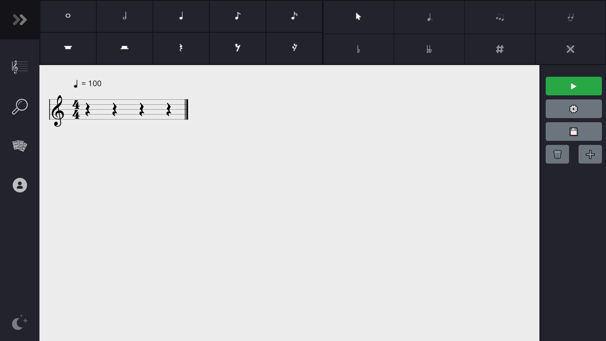
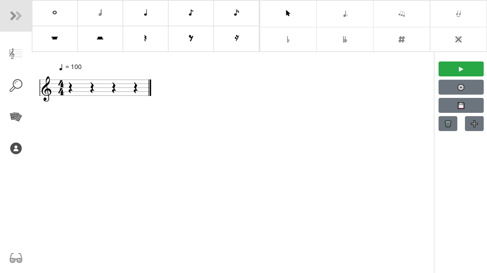
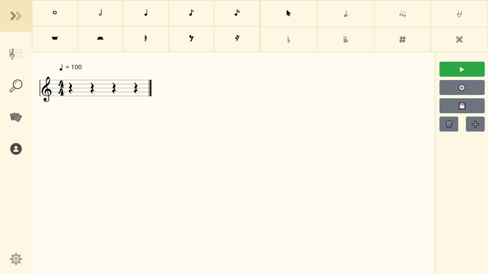
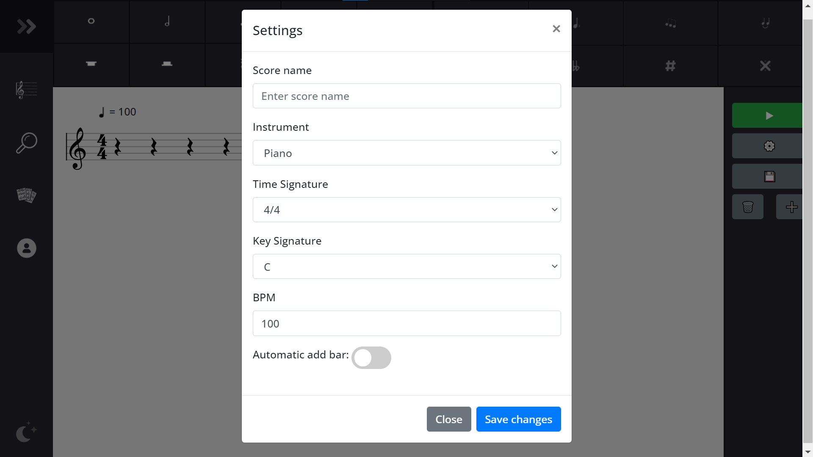
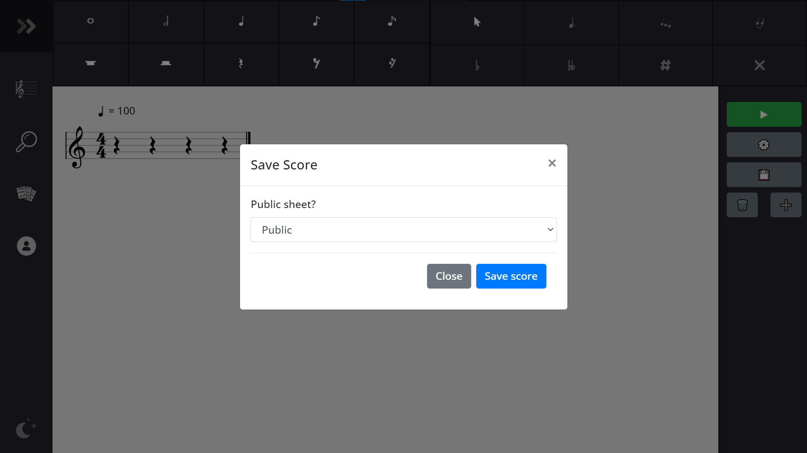
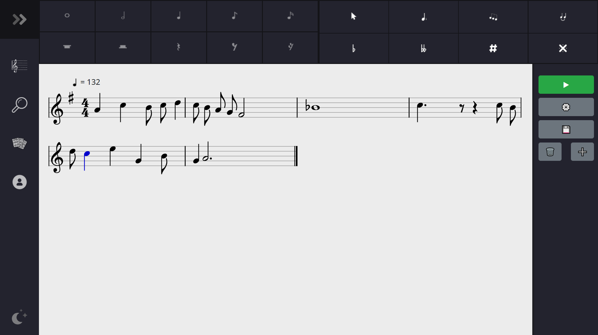
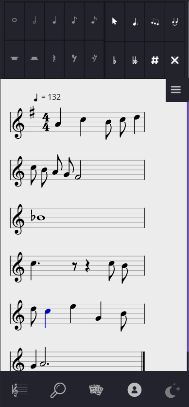
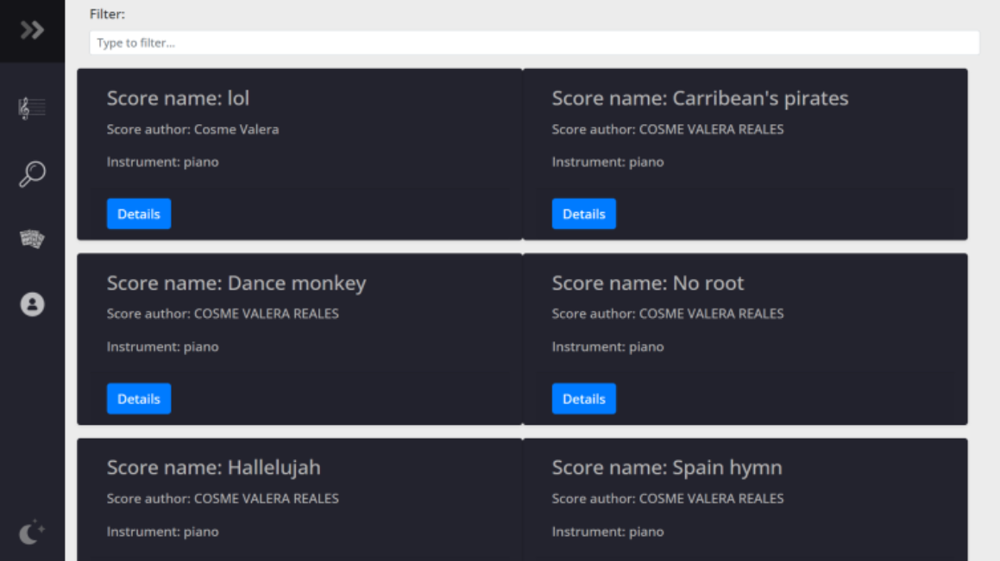
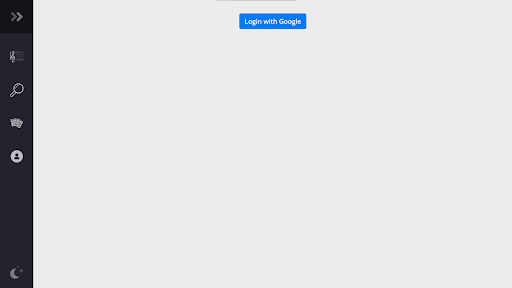
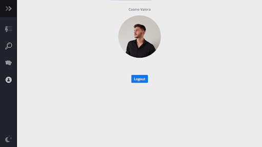

# Sympho
An app to compose, save, edit and play music scores. In addition, you can log in using Google and then store your music sheets in your private and/or public repository.
- The **composer** window has 3 themes: dark, light and solar:

  - The left bar is the navigation menu where you can move to another window, there are 4: composer, public repository, private repository, account. And you can also change the theme.
  - The top bar is a toolbar that has 2 clearly differentiated parts. In the left part you can choose the note duration and whether it's a rest. In the right part, you can also add accidentals, dots... to the notes you had already put.
  - The right bar has some buttons, I'll proceed to explain them:
    - The play button is used to reproduce the sheet music.
    - The settings button is used to alter the settings of the score: you can change the settings to add a name to the score, change instrument, bpm... 
    
    - The right bar also has a save button, with this button you can choose to save the sheet music publicly or privately, if you save it privately it'll be stored just in your private repository. However, if you save it publicly it'll be stored in the public repository AND in the private repository. 
    

  - Sheet music example (computer & phone):
  
  

- This is how the **private repository** looks like (each card has an edit button):

- This is how the **public repository** looks like, the only difference with the private repository is that each card has a details button and in the private repository it is instead an edit button (you can edit your scores, but you cannot edit another person's score):

- This is how the **account** window looks like (before and after the login):

