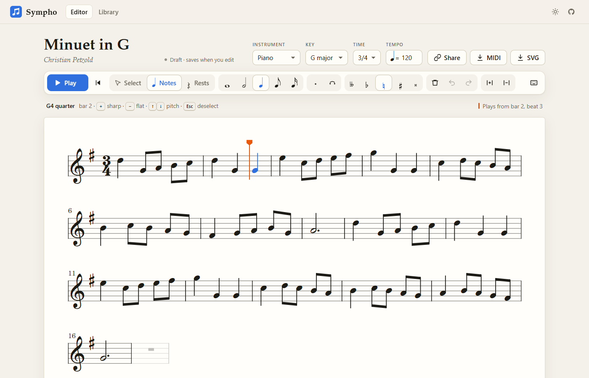

# Sympho

Write sheet music in the browser, hear it played back, and share it with a link. Nothing to install and no account needed.

**Live:** [sympho.cosmevalera.dev](https://sympho.cosmevalera.dev)



## Features

- **Click to compose.** A ghost note follows the cursor and shows the pitch it will write. Click an existing note to select it.
- **Keyboard entry.** Type `A`–`G` to add notes, `1`–`5` for values, arrows to move and select, `Space` to play. Press `?` in the app for the full list.
- **Correct notation.** Notes that cross a barline are split and tied, gaps fill with rests, and 6/8 groups in dotted quarters. Engraving is done by [VexFlow](https://www.vexflow.com/).
- **Playback** with sampled piano, flute, guitar and synth bass ([Tone.js](https://tonejs.github.io/)). The playing note is highlighted as it sounds.
- **Library.** Scores save automatically in your browser, with thumbnails, duplicate and delete. Five examples to start from.
- **Share links.** The whole score is compressed into the URL, so there is no server.
- **Export** to MIDI, or SVG with the music fonts embedded.
- **Undo/redo**, light, dark and solarized themes, and a layout that works on phones.

## Development

Requires Node.js 20 or newer.

```sh
npm install
npm run dev       # http://localhost:5173
npm test          # music engine tests (Vitest)
npm run lint      # oxlint
npm run build     # type-check and build into dist/
```

## How it works

- `src/music/` is a framework-free engine. A score is a list of measures of events, timed in 32nd-note ticks. Every edit flattens the music into a timeline, writes into it, and re-bars it, which is how ties, rests and meter changes stay consistent. It is covered by the tests in `score.test.ts`.
- `src/render/` draws a score with VexFlow into SVG and returns a layout map, which the editor uses for hit-testing clicks and placing the ghost note.
- `src/audio/` schedules playback on the Tone.js transport. Tone.js loads lazily on the first sound, and MIDI export also loads on demand.
- `src/state/` holds the editor reducer (with undo history) and `localStorage` persistence.
- Routing uses the URL hash (`#/library`, `#/example/<slug>`, `#/s/<data>`), so any static host works.

Stack: React 19, TypeScript, Vite, VexFlow 5, Tone.js, Vitest. Deployed on Vercel.

## History

Sympho started as a team project by [Cosme Valera](https://github.com/CosmeValera) and [p-jgomariz](https://github.com/p-jgomariz): a vanilla JS app with Google sign-in, a MongoDB API and Kubernetes deployment manifests. Version 2 is a rewrite of the editor as a static React app. Accounts and the public repository were dropped in favour of local storage and share links. Triplets from the original aren't ported yet. The original code is in the git history.
